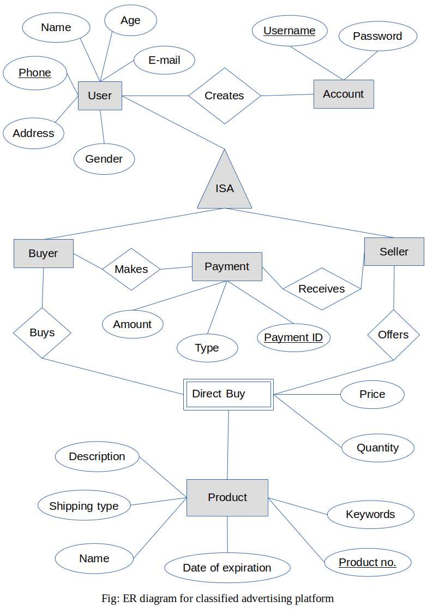
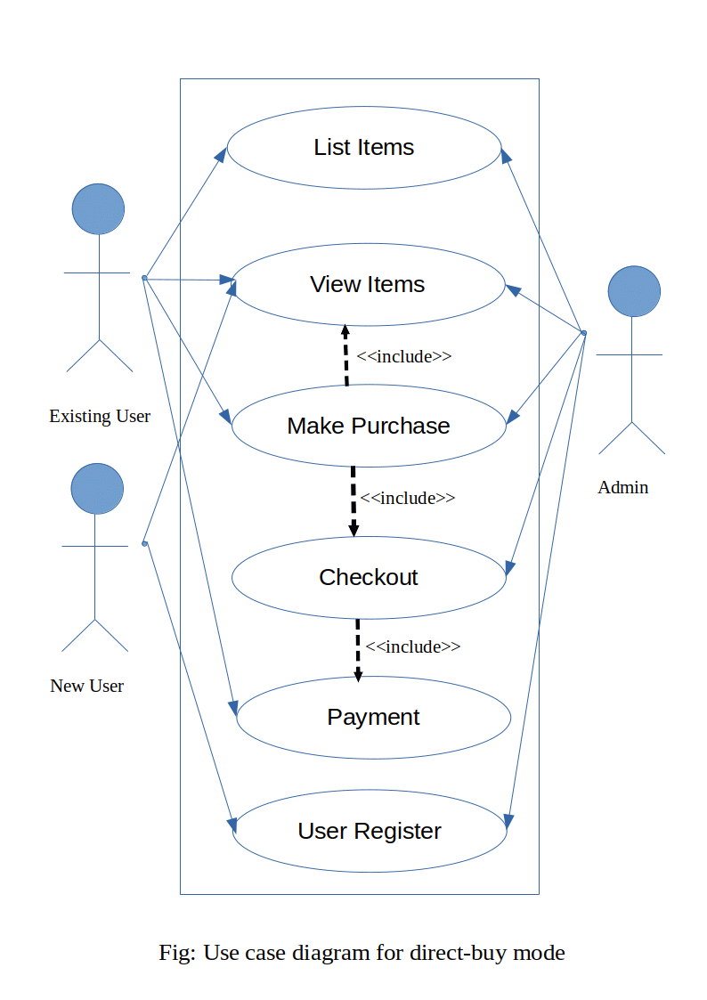
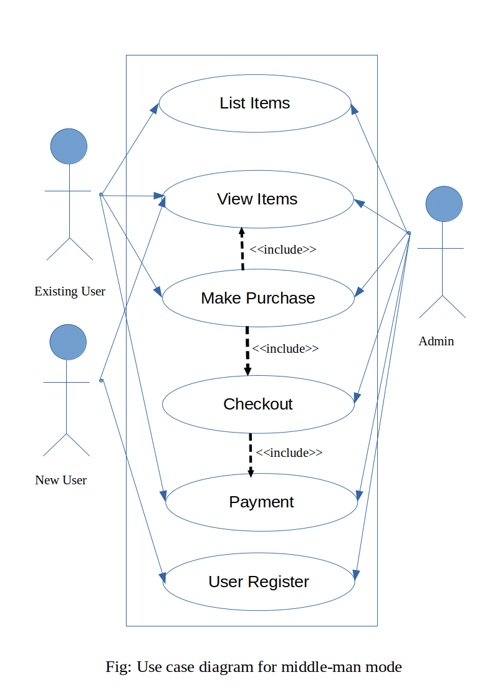

# TRIBHUWAN UNIVERSITY 

# PURWANCHAL CAMPUS 

# TINKUNE, DHARAN 

# A 

# PROJECT PROPOSAL 

# ON 

# CLASSIFIED ADVERTISING PLATFORM (SASTOSAAMAN) 

# SUBMITTED TO 

# DEPARTMENT OF ELECTRONICS AND COMPUTER ENGINEERING 

 

# SUBMITTED BY: 

# ANISH JOSHI (anishjoshi1999@gmail.com) 

# SUJAN KARKI (sujankarki269@gmail.com) 

# NIRUTA DIMAL (nirutadhimal7@gmail.com) 

# PRADIP SAPKOTA (mr.prasag@gmail.com) 

# FEB 15, 2021 

 

# Acknowledgement 

We are thankful to all those who have helped us directly or indirectly with this project. Foremost, we would like to thank purwanchal campus for providing us this project, “Classified Advertising platform (SastoSaaman)”.We would like to thank Er. Pravin Sangroula for his guidelines for this project and for organizing this course and acknowledge his effort that encouraged us to take this challenging project. We would also like to offer our gratitude to all our teachers whose lectures and ideas were the basis for our project research and appreciate the support rendered by Department of Computer Engineering, ERC. 

# Abstract 

The project entitled “Classified Advertising platform (SastoSaaman)” is a website for buying and selling items. Classified advertising is a form of advertising, particularly common in newspapers, online and other periodicals, which may be sold or distributed free of charge. Classified advertisements are much cheaper than larger display advertisements used by businesses. SastoSaaman is a free classifieds and online marketplace that helps users to sell, buy or discover anything across Nepal. This project is the combination of Online market place and Online Classified Advertising platform.Community members can come to our site to sell their old car, bike, music system, laptop or furniture,buy any item that they might want or have to offer and make new friends while doing all of the above. 

# TABLE OF CONTENTS 
# Abstract ............................................................... i 
# Acknowledgement ................................................................. ii 
# List of Figures .......................................................................... iv 
# 1 Introduction ................................................................... 1 
# 2 Objective and scope ......................................................... 2 
# 2.1 Objectives ........................................................................... 2 
# 2.2 Scope ............................................................................... 2 
# 3 Literature Review .................................................................. 3 
# 3.1 Background ............................................. 3 
# 3.2 Existing Situation .............................................. 3 
# 3.2.1 Proposed system
# 3.3 NodeJS(Javascript) ......................................................... 4 
# 3.4 MONGODB ............................................................. 5 
# 3.5 Express.js.......................................................................... 5 
# 3.6 React.js..................................................................... 5 
# 3.6 E-R diagram ............................................... 6 
# 3.7 System Environment .................................... 7 
# 3.7.1 Hardware requirements ....................... 7 
# 3.7.2 Software requirements ....................................... 7 
# 4 Design Diagrams .................................................... 8 
# 4.1 Use Case Diagram ........................................ 8 
# 4.1.1 Use Case Diagram for XYZ ........................... 8 
# 4.1.2 Use Case Diagram for ABC .............................................................................. 9 
# 4.1.3 Use Case Diagram for EFG .......................................................................10 
# 5 Feasibility Study ...........................................................11 
# 5.1 Technical Feasibility ......................................................11 
# 5.2 Economic Feasibility ...................................................11 
# 5.3 Operational Feasibility ...........................................12 
# 6 Architecture of CLASSIFIED ADVERTISING PLATFORM .........................13 
# 7 Project Schedule .............................................................14 
# 8 Conclusion ..........................................................................15 
# 9 References ............................................................16 iv 

# List of Figures and Graphs 

Figure 1: E-R Diagram …........................................ 

Figure 2: System Block Diagram ……………………………………………………………………………………………. 

Figure 3: XYZ……………………………………………………………………………………………………….. 

Figure 4: ABC …………………………………………………………………………………………. 

Table 1: Project Tools …………………………………………………………………………………………………………… 

Table 2: Cost Estimation ………………………………………………………………………………………………………… 

# 1.Introduction(new)

Classified advertising is a form of advertising which is particularly common in newspapers, online and other periodicals, e.g., free ads on papers. Classified advertising allows private individuals (not simply companies or corporate entities) to try to sell products or services. Classified advertising is called that because it is generally grouped within the publication under headings classifying the product or service being offered (headings such as electronics, Automobiles, Clothing, For Sale, For Rent, etc.) and is grouped entirely in a distinct section of the periodical, which makes it distinct from display advertising, which often contains graphics or other art work and which is placed near to editorial content. 

Newspapers are continuing to make less and less money from classified advertising because more and more people are using the Internet now and fewer people are reading newspapers. 

Online classified advertising is one of the fastest-growing types of online advertising. Online classifieds are all about buying and selling a range of goods and services. Online classifieds could be categorised into automobiles, furniture, matrimony, recruitment, real estate, etc. 

Online classifieds could be of two types: Horizontal and Vertical. The horizontal classifieds include different products ranging from furniture, electronics, apparels, etc. The vertical classified is restricted to a single platform for instance LinkedIn which advertises different jobs and vacancies. 

The online classified market is expected to increase due to growth in the retail e-commerce industry, increase in a number of smartphone users, increasing internet penetration, growing global youth population, etc. Yet the market faces some challenges such as, need for technological barriers, developing country barriers, social media threat, etc. As the online classified advertising sector develops, there is an increasing emphasis toward specialization. 

# 2 Objective and scope
This encloses the needs and scope of the development of the project. The objectives can be explained as following:
# 2.1	Objectives
1    To make buying and selling of secondhand items easy and convenient.
2    To connect interested buyers and sellers.
3.   To provide information about various products in a different category.
4.   Customer can login and get various information about products and can purchase a suitable product with price and quality comparison.
5.   Customer can login and post information about the products they want to sell.
# 2.2 Scope
1.  Customers can buy and sell products online.
2.  This can be used as online marketplace and classified advertising platform.
3.  Buyers and Sellers are connected and  transaction are done through this site, this reduces the chances of fraud and scam.

# 3 Literature Review 
# 3.1 Background 
# 3.2 Existing Situation 
# 3.2.1 Proposed system
The proposed system aims online marketplace of classified advertising platform for buying and selling services and goods such as electronics, fashion items , furniture, household  goods, cars, bikes, stationary products etc. This system uses web service. The data (product details and users data ) are stored in database that will be the centre of all information. Web sever fetches data from database and show to the user as required or mentioned. The architecture of our proposed system is three tire architecture(data teir, application teir, presentation teir.) 

A simple block diagram has been presented here which gives some insight into the structure of the system. This block diagram is for illustration purpose. All the components of the system will be elaborated in final block diagram. 

# 3.3 NodeJS(Javascript)
# 3.4 MONGODB 
# 3.5 Express.js
# 3.6 React.js
# 3.7 System Environment 
# 3.7.1 Hardware requirements 
# 3.7.2 Software requirements

# 4 Design Diagrams 
# 4.1 ER diagram

# 4.1.1 Use Case Diagram for direct-buy mode
 
# 4.1.2 Use Case Diagram for middle-man mode
 
# 4.1.3 Use Case Diagram for EFG
   
# 5.FEASIBILITY ANALYSIS
For the system that is to be developed must satisfy all the feasible strategy.This step deals with the various types of the feasibilities that are needed to be considered during the system development. Mainly there are different types of feasibility that are needed to be considered and they are:
# 5.1 Technical feasibility
The necessary technology to develop our project "CLASSIFIED ADVERTISING PLATFORM ". Software like Node.js and MongoDB can be used to develop the back end which contains the actual database in which various information are stored which can be manipulated or retrieved as per the requirement. React.js front-end framework can be used to develop a user friendly interface to be used by the system user. Therefore the project team feels it is capable of making use of the available technology to build "CLASSIFIED ADVERTISING PLATFORM" website. Hence the system is technically feasible.
# 5.2 Economic Feasibility 
⋅⋅* XYZ
⋅⋅* ABC

# 5.3 Operational Feasibility
Lorem ipsum dolor sit amet, consectetur adipiscing elit. Donec vitae lacinia tellus, a euismod ex. Fusce leo odio, posuere dignissim tincidunt sed, interdum vitae quam. Sed et dui venenatis, luctus justo sed, venenatis lectus. Ut interdum consectetur erat, eu volutpat est consequat et. Vestibulum non elit magna. Duis tortor ex, mollis eget volutpat sit amet, tempus bibendum arcu. Mauris semper mi non vulputate facilisis. Maecenas at lectus in enim egestas euismod. Etiam vitae elit porta, egestas eros non, commodo est. Nunc mollis mollis justo vitae iaculis. Curabitur dolor lectus, ultrices at porttitor in, fringilla a mi. Nullam pharetra rhoncus vulputate. Maecenas et sapien non nisi suscipit tempus eleifend vitae dui. Quisque ultricies quis nisl quis pellentesque.
# 6 Architecture of CLASSIFIED ADVERTISING PLATFORM

# 7 Project Schedule 

# 8 Conclusion 
# 9 References 

